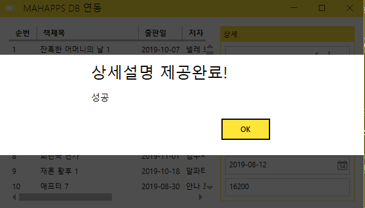

# iot_csharp_wpf_2025
iot 개발자 wpf 학습

## 64일차(5/8)

### WPF(Windows Presentation Foundation) 개요
- WinForms의 디자인의 미약한 부분, 속도 개선, 개발과 디자인의 분리 개선하고자 만든 MS  프레임워크
- 화면디자인을 XML기반의 xaml

### WPF DB 바인딩 (with MahApps) [db연동](./day64/Day01Wpf/WpfBasicApp1/MainWindow.xaml)
1. 프로젝트 생성 - 새프로젝트>WPF 애플리케이션
2. Nuget 패키지 관리자 >MahApps.Metro 라이브러리 설치
3. 디자인 영역
    - App.xaml
    ```xml
        <ResourceDictionary>
            <ResourceDictionary.MergedDictionaries>
                    <!-- MahApps.Metro resource dictionaries. Make sure that all file names are Case Sensitive! -->
                    <ResourceDictionary Source="pack://application:,,,/MahApps.Metro;component/Styles/Controls.xaml" />
                    <ResourceDictionary Source="pack://application:,,,/MahApps.Metro;component/Styles/Fonts.xaml" />


                    <!-- Theme setting -->
                    <ResourceDictionary Source="pack://application:,,,/MahApps.Metro;component/Styles/Themes/Light.Yellow.xaml" />

            </ResourceDictionary.MergedDictionaries>
        </ResourceDictionary>
    ```

    - MainWindow.xaml
        ```xml
            <mah:MetroWindow x:Class="WpfBasicApp1.MainWindow"
            xmlns:mah="http://metro.mahapps.com/winfx/xaml/controls"
            xmlns:iconpacks="http://metro.mahapps.com/winfx/xaml/iconpacks"
            Loaded="MetroWindow_Loaded">
        ```
    - MainWindow.xaml.cs

        ```csharp
        using MahApps.Metro.Controls;
        public partial class MainWindow : MetroWindow
        ```

4. UI 구현 [MainWindow.xaml](./day64/Day01Wpf/WpfBasicApp1/MainWindow.xaml)
    - DataGrid + SqlDataAdapter
        - AutoGenerateColumns="True" 는 모든 열
             
        - AutoGenerateColumns="False"
        ```xml
         <DataGrid x:Name="GrdBooks" Grid.Row="0" Grid.Column="0" Margin="5" AutoGenerateColumns="False">
            <DataGrid.Columns>
                <DataGridTextColumn Binding="{Binding Idx}" Header="순번"/>
                <DataGridTextColumn Binding="{Binding Names}" Header="책제목"/>
                <DataGridTextColumn Binding="{Binding ReleaseDate}" Header="출판일"/>
                <DataGridTextColumn Binding="{Binding Author}" Header="저자"/>
                <DataGridTextColumn Binding="{Binding Division}" Header="장르"/>
                <DataGridTextColumn Binding="{Binding ISBN}" Header="ISBN"/>
                <DataGridTextColumn Binding="{Binding Price}" Header="책가격"/>
            </DataGrid.Columns>
        </DataGrid>
        ``` 
        -  
    - DataGrid 한 행 선택한 것을 DataRowView로 형변환
        ```csharp
        // DATAGRID에서 더블클릭했을 때 이벤트- 선택한 그리드의 레코드값이 오른쪽 GROUPBOX에 출력함
        private void GrdBooks_MouseDoubleClick(object sender, MouseButtonEventArgs e)
        {
            //사용자가 선택한 행이 정확히 한 개인지 확인합니다.
            //DataGrid는 다중 선택이 가능하므로, 1개만 선택됐을 때만 처리하도록 조건을 줍니다.
            if (GrdBooks.SelectedItems.Count ==1) 
            {
                //DataRowView는 DataTable을 바인딩한 경우, 각 행을 나타냅니다.
                //GrdBooks.ItemsSource는 DataTable.DefaultView나 DataView 등으로 바인딩되어 있어야 합니다.
                //즉, DataGrid가 DataRowView 타입의 데이터를 보여주고 있어야 이 코드가 제대로 작동합니다.
                //데이터 그리드에 로드데이터할 때, adapter.Fill(dt)여서 가능함
                var item = GrdBooks.SelectedItems[0] as DataRowView;
                //MessageBox.Show(item.Row["Names"].ToString());

                NUD.Value = Convert.ToDouble(item.Row["Idx"]);
                CboDivisions.SelectedValue = Convert.ToString(item.Row["Division"]);
                TxtBookAuthor.Text = Convert.ToString(item.Row["Author"]);
                TxtBookName.Text= Convert.ToString(item.Row["Names"]);
                TxtISBN.Text = Convert.ToString(item.Row["ISBN"]);
                TxtPrice.Text = Convert.ToString(item.Row["Price"]);
                DP.Text = Convert.ToString(item.Row["ReleaseDate"]);
            }
        }
        ```
    
5. DB연결 사전준비
    - Nuget 패키지 관리자 > MySQL.Data 라이브러리 설치

6. DB연결 
    1. DB연결문자열(connectionString): DB종류마다 연결문자열 포맷이 다르고 무조건 있어야 함
    2. 쿼리 : 실행할 쿼리(보통 SELECT, INSERT, UPDATE, DELETE)
    3. 데이터를 담을 객체 : 리스트 형식
    4. DB연결객체(SqlConnection) : 연결문자열을 처리하는 객체 . DB연결,끊기, 연결확인...
        - DB연결종류별로 MySqlConnection, SqlConnection, OracleConnection
    5. DB명령객체(SqlDataCommand) : 쿼리 컨트롤하는 객체, 생성시 쿼리와 연결객체
        - ExecuteReader() : SELECT문 실행, 결과 데이터를 담는 메서드
        - ExecuteNonQuery() : INSERT, UPDATE, DELETE문과 같이 트랜젝션이 발생하는 쿼리실행 사용 메서드
        - ExecuteScaler() : SELECT문 중 count() 등 함수로 1row/1column 데이터만 가져오는 메서드
    6. 데이터어댑터(SqlDataAdapter) : 연결이후 데이터처리를 쉽게 도와주는 객체
        - DB명령객체처럼 쿼리를 직접실행할 필요없음
        - DataTable, DataSet객체에 fill()메서드로 자동으로 채워줌
        - 거의 SELECT문에만 사용
        ```csharp
        string connectionString = "Server=localhost;Database=madang;Uid=root;Pwd=12345;Charset=utf8";
        string query = "SELECT Idx,Author,Division,Names,ReleaseDate,ISBN,Price FROM bookstbl";

        using (MySqlConnection conn = new MySqlConnection(connectionString)) 
        {
            try 
            {
                conn.Open();
                MySqlDataAdapter adapter = new MySqlDataAdapter(query, conn);
                DataTable dt = new DataTable();
                adapter.Fill(dt);

                GrdBooks.ItemsSource = dt.DefaultView;
            }
            catch (MySqlException ex)
            {
            
            }
        }
        ```
    7. DB데이터리더
        - DataReader :ExecuteReader()로 가져온 데이터를 조작하는 객체
        ```csharp
            //1. db연결문자열
            string connectionString = "Server=localhost;Database=madang;Uid=root;Pwd=12345;Charset=utf8";
            //2. 사용쿼리
            string query = "SELECT Division,Names FROM divtbl";

            List<KeyValuePair<string, string>> divisions = new List<KeyValuePair<string, string>>();

            //3. db연결, 명령, 리더
            using (MySqlConnection conn = new MySqlConnection(connectionString)) 
            {
                try 
                {
                    conn.Open();
                    MySqlCommand cmd = new MySqlCommand(query, conn);
                    MySqlDataReader reader = cmd.ExecuteReader();
                    while (reader.Read()) 
                    {
                        var division = reader.GetString("Division");
                        var name = reader.GetString("Names");
                        divisions.Add(new KeyValuePair<string, string> (division, name));
                        
                    }
                }
                catch (MySqlException ex)
                {
                
                }
                CboDivisions.ItemsSource = divisions;
            }
        ```
        

7. 실행결과
    - DATAGRID에서 더블클릭했을 때 이벤트- 선택한 그리드의 레코드값이 오른쪽 GROUPBOX에 출력함
    - 

8. MahApps.Metro 방식 다이얼로그 처리
    ```csharp
     private async void GrdBooks_MouseDoubleClick(object sender, MouseButtonEventArgs e)
    {
        //사용자가 선택한 행이 정확히 한 개인지 확인합니다.
        //DataGrid는 다중 선택이 가능하므로, 1개만 선택됐을 때만 처리하도록 조건을 줍니다.
        if (GrdBooks.SelectedItems.Count ==1) 
        {
            //DataRowView는 DataTable을 바인딩한 경우, 각 행을 나타냅니다.
            //GrdBooks.ItemsSource는 DataTable.DefaultView나 DataView 등으로 바인딩되어 있어야 합니다.
            //즉, DataGrid가 DataRowView 타입의 데이터를 보여주고 있어야 이 코드가 제대로 작동합니다.
            //데이터 그리드에 로드데이터할 때, adapter.Fill(dt)여서 가능함
            var item = GrdBooks.SelectedItems[0] as DataRowView;
            //MessageBox.Show(item.Row["Names"].ToString());

            NUD.Value = Convert.ToDouble(item.Row["Idx"]);
            CboDivisions.SelectedValue = Convert.ToString(item.Row["Division"]);
            TxtBookAuthor.Text = Convert.ToString(item.Row["Author"]);
            TxtBookName.Text= Convert.ToString(item.Row["Names"]);
            TxtISBN.Text = Convert.ToString(item.Row["ISBN"]);
            TxtPrice.Text = Convert.ToString(item.Row["Price"]);
            DP.Text = Convert.ToString(item.Row["ReleaseDate"]);


        }
        await this.ShowMessageAsync($"상세설명 제공완료!", "성공");
    }
     ```
    - 
9. 여기까지 개발한 방식은 전통적인 C# 윈앱개발과 차이가 없음

### WPF MVVM
- [디자인 패턴](https://ko.wikipedia.org/wiki/%EC%86%8C%ED%94%84%ED%8A%B8%EC%9B%A8%EC%96%B4_%EB%94%94%EC%9E%90%EC%9D%B8_%ED%8C%A8%ED%84%B4)
    - 소프트웨어 공학에서 공통적으로 발생하는 문제를 재사용 가능하게 해결한 방식들
    - 반복적으로 되풀이 되는 개발디자인의 문제를 해결하도록 맞춤화시킨 양식(템플릿)
    - 여러 디자인패턴 중 아키텍쳐패턴, 그 중 디자인고 개발을 분리해 개발할 수 있는 패턴을 준비
        - MV* : MVC, MVP, MVVM...

- MVC : Model View Controller 패턴
    - 사용자 인터페이스(View)와 비즈니스 로직(Controller, Model)분리해서 앱을 개발
    - 디자이너에게 최소한의 개발에 참여를 시킴
    - 개발자는 디자인은 고려하지 않고 개발만 할 수 있음
    - 사용자는 Controller에게 요청
    - Controller가 Model에게 Data를 요청
    - Model이 DB에 데이터를 가져와 Controller로 전달
    - Controller는 데이터를 비즈니스로직에 따라서 처리하고 View로 전달
    - View는 데이터를 화면에 뿌려주고, 화면상에 처리할 것을 마친 후 사용자에게 응답
    
- MVP : Model-View-Presenter 패턴
    - MVC 패턴에서 파생됨
    - Presenter : Supervising Controller라고 부름
- MVVM : Model-View-ViewModel 패턴
    - MVC 패턴에서 파생됨
    - 마크업언어로 GUI코드를 구현하는 아키텍처
    - 사용자는 View로 접근(MVC와의 차이점)
    - ViewModel이 Controller역할(비즈니스로직 처리)
    - Model은 당연히 DB요청, 응답
    - 연결방식이 MVC와 다름
    - 전통적인 C#방식은 사용자가 이벤트발생시키기 때문에 발생시기를 바로 알 수 있음
    - MVVM방식은 C#이 변화를 주시하고 있어야 함. 상태가 바뀌면 변화를 줘야함
    - 
- MVVM  장단점
    - View <-> ViewModel 간 데이터 자동 연동
    - 로직 분리로 구조가 명확해짐. 자기할일만 하면 됨.
    - 팀으로 개발시 역할분담이 확실. 팀프로젝트에 알맞음
    - 테스트와 유지보수는 쉬움
    - 구조가 복잡. 디버깅이 어려움.
    - 스케일이 커짐

### WPF MVVM 연습 [(MVVM DB연동 디자인)](./day64/Day01Wpf/WpfBasicApp2/View/MainView.xaml) [(MVVM DB연동 소스)](./day64/Day01Wpf/WpfBasicApp2/ViewModel/MainViewModel.cs)
1. 프로젝트 생성 , app.xaml, MainWindow.xaml, MainWindow.axml.cs 수정
2. WPF 바인딩 연습시 사용한 MainWindow.xaml의 UI 복사
3. Model, View, ViewModel 폴더 생성
4. MainWindow.xaml을 View로 이동
5. ** App.xaml에서 StartupUri 수정**
    ```csharp
    StartupUri="/View/MainWindow.xaml"
    ```
6. Model폴더 내 Book.cs 생성 [Book.cs](./day64/Day01Wpf/WpfBasicApp2/Model/Book.cs)
    - **INotifyPropertyChanged 인터페이스 : 객체내의 어떠한 속성값이 변경되면 상태를 C#에게 알려주는 기능**
    - **PropertyChangedEventHandler 이벤트 생성**
    ```csharp
        public class Book : INotifyPropertyChanged
        {
            public int Idx {  get; set; }
            public string Names { get; set; }
            public string Author {  get; set; }
            public string Division {  get; set; }
            public string DNames { get; set; }

            public string ISBN {  get; set; }   
            public int Price {  get; set; }

            public DateTime ReleaseDate {  get; set; }
            
            //위의 여덟개의 값이 기존상태에서 변경이 되면 발생하는 이벤트
            //사용자가 클릭같은 거로 발생하는 이벤트가 아님
            public event PropertyChangedEventHandler? PropertyChanged;
        }
    ```

7. ViewModel폴더 내 MainViewModel.cs 생성
    - INotifyPropertyChanged 인터페이스 : 객체내의 어떠한 속성값이 변경되면 상태를 C#에게 알려주는 기능
    - PropertyChangedEventHandler 이벤트 생성

## 65일차(5/9)
### WPF MVVM 연습 [(MVVM DB연동 디자인)](./day64/Day01Wpf/WpfBasicApp2/View/MainView.xaml) [(MVVM DB연동 소스)](./day64/Day01Wpf/WpfBasicApp2/ViewModel/MainViewModel.cs)
8. View와 ViewModel 연동 준비작업
    - MainViewModel.cs 에 변화알림 이벤트 
    ```csharp

    public event PropertyChangedEventHandler? PropertyChanged;

    protected void OnPropertyChanged(string propertyName)
    {   //기본적인 이벤트핸들러 파라미터와 동일(Object sender, EventArgs e)
        PropertyChanged?.Invoke(this, new PropertyChangedEventArgs(propertyName));        
    }

    ```
    - MainView.xaml에 연동
    ```xml
    <mah:MetroWindow 
    xmlns:vm="clr-namespace:WpfBasicApp2.ViewModel"
    DataContext="{DynamicResource MainVM}" >

    <mah:MetroWindow.Resources>
        <!--MainViewModel을 가져와서 사용하겠다.-->
        <vm:MainViewModel x:Key="MainVM"/>
    </mah:MetroWindow.Resources>


    ```

9. View-MainViewModel 연결(1) - MainViewModel에서 DB연동(divtbl데이터)하고 View(combobox장르 컨트롤)에서 데이터(장르)를 보여주기
    - MainViewModel.cs 코드 
        ```csharp
        //groupbox의 combobox에 넣을 데이터 저장할 리스트
        public ObservableCollection<KeyValuePair<string, string>> Divisions { get; set; }
        ```
       
        ```csharp
         //db연동코드
        private void LoadControlFromDb()
        {
            string connectionString = "Server=localhost;Database=madang;Uid=root;Pwd=12345;Charset=utf8";
            string query = "SELECT Division,Names FROM divtbl";

            ObservableCollection<KeyValuePair<string, string>> divisions = new ObservableCollection<KeyValuePair<string, string>>();

            using (MySqlConnection conn = new MySqlConnection(connectionString))
            {
                try
                {
                    conn.Open();
                    MySqlCommand cmd = new MySqlCommand(query, conn);
                    MySqlDataReader reader = cmd.ExecuteReader();
                    while (reader.Read())
                    {
                        var division = reader.GetString("Division");
                        var name = reader.GetString("Names");
                        divisions.Add(new KeyValuePair<string, string>(division, name));
                    }
                }
                catch (MySqlException ex)
                {
                }

                Divisions = divisions;
                OnPropertyChanged(nameof(Divisions));
            }
        }
        ```
    - View의 MainView.xaml
    ```xml
    <!--combobox에 바인딩-->
    <ComboBox  ItemsSource="{Binding Divisions}">
    ```

10. View-MainViewModel 연결(2) - MainViewModel에서 DB연동(bookstbl데이터)하고 View(데이터그리드 컨트롤)에서 데이터를 보여주기
    - MainViewModel.cs 코드
    ```csharp
    //datagrid에 넣을 데이터 저장할 리스트
    public ObservableCollection<Book> Books { get; set; } 
    ```
    ```csharp
    //db연동
    // DATAGRID 컨트롤에 로드되는 데이터
    private void LoadGridFromDb()
    {
        string connectionString = "Server=localhost;Database=madang;Uid=root;Pwd=12345;Charset=utf8";
        string query = "SELECT b.Idx,b.Author,b.Division ,b.Names, b.ReleaseDate,b.ISBN,b.Price, d.Names as dNames FROM bookstbl b, divtbl d WHERE b.Division = d.Division order by b.Idx";

        ObservableCollection<Book> books = new ObservableCollection<Book>();

        using (MySqlConnection conn = new MySqlConnection(connectionString))
        {
            try
            {
                conn.Open();
                MySqlCommand cmd = new MySqlCommand(query, conn);
                MySqlDataReader reader = cmd.ExecuteReader();
                while (reader.Read())
                {
                    books.Add(new Book
                    {
                        Idx = reader.GetInt32("Idx"),
                        Division = reader.GetString("Division"),
                        Author = reader.GetString("Author"),
                        Names = reader.GetString("Names"),
                        DNames = reader.GetString("DNames"),
                        ISBN = reader.GetString("ISBN"),
                        Price = reader.GetInt32("Price"),
                        ReleaseDate= reader.GetDateTime("ReleaseDate")
                    });
                }
            }
            catch (MySqlException ex)
            {
            }
            Books = books;
            OnPropertyChanged(nameof (Books));
        }
    }

    ```
    - View의 MainView.xaml
    ```xml
    <!--datagrid에 바인딩--> 
    <DataGrid  ItemsSource="{Binding Books}">

    <!-- datagrid 태그 안 각각의 속성 바인딩--> 
    <!--*주의할점: Books 속성에서 정의한 이름 그대로 써야함-->
    <DataGridTextColumn Binding="{Binding DNames}" Header="장르명" />

    ```

11. View-MainViewModel 연결(3) - View(데이터그리드 컨트롤)에서 선택한 행의 데이터를  View(groupbox컨트롤)에 보여주기
    - View의 MainView.xaml
    ```xml
    <!--datagrid에 선택아이템속성추가--> 
    <DataGrid  ItemsSource="{Binding Books}" SelectedItem="{Binding SelectedBook , Mode=TwoWay}">

    <!--groupbox의 각각의 컨트롤의 속성에 코드 추가--> 
    <mah:NumericUpDown     Value="{Binding SelectedBook.Idx}"/>
    <ComboBox SelectedValue="{Binding SelectedBook.Division}"></ComboBox>
    <DatePicker SelectedDate="{Binding SelectedBook.ReleaseDate}"></DatePicker>

    ```

    - MainViewModel.cs 코드
    ```csharp
    //선택한 행 담을 변수

    public Book _selectedBook;

    public Book SelectedBook
    {
        //람다식 표현, get{ return _selectedBook; }와 동일
        get => _selectedBook;
        
        set
        {
            _selectedBook = value;
            //값이 변경된 것을 알아차리도록 해줘야함!!
            OnPropertyChanged(nameof(SelectedBook));
        }
    }

    ```
    - `public Book Book { get; set; }는 멤버변수가 자동으로 정의된다.(public Book _book;)`
12. 실행결과
    

https://github.com/user-attachments/assets/42fa4f15-9cb1-43dc-a6b9-3c699bb0aa89


13. MainView.xmal 컨트롤에 바인딩 작업
    - [전통적인 C# 방식](./day64/Day01Wpf/WpfBasicApp1/MainWindow.xaml) : x:Name사용(MainView.xaml.cs에서 사용필요) , 마우스이벤트 추가 
    ```xml
    <DataGrid x:Name="GrdBooks" Grid.Row="0" Grid.Column="0" Margin="5" AutoGenerateColumns="False" IsReadOnly="True" MouseDoubleClick="GrdBooks_MouseDoubleClick">
    <DataGrid.Columns>
        <DataGridTextColumn Binding="{Binding Idx}" Header="순번"/>
        <DataGridTextColumn Binding="{Binding Names}" Header="책제목"/>
        <DataGridTextColumn Binding="{Binding ReleaseDate, StringFormat='yyyy-MM-dd'}" Header="출판일"/>
        <DataGridTextColumn Binding="{Binding Author}" Header="저자"/>
        <DataGridTextColumn Binding="{Binding Division}" Header="장르" Visibility="Hidden"/>
        <DataGridTextColumn Binding="{Binding dNames}" Header="장르명" />
        <DataGridTextColumn Binding="{Binding ISBN}" Header="ISBN"/>
        <DataGridTextColumn Binding="{Binding Price, StringFormat={}{0:N0}원}" Header="책가격"/>
    </DataGrid.Columns>
    </DataGrid>
    ```
    - [WPF MVVM 바인딩 방식](./day64/Day01Wpf/WpfBasicApp2/View/MainView.xaml) : 전부 Binding 사용
    ```xml
    <DataGrid  Grid.Row="0" Grid.Column="0" Margin="5" AutoGenerateColumns="False" IsReadOnly="True" ItemsSource="{Binding Books}" SelectedItem="{Binding SelectedBook , Mode=TwoWay}">
     <DataGrid.Columns>
         <DataGridTextColumn Binding="{Binding Idx}" Header="순번"/>
         <DataGridTextColumn Binding="{Binding DNames}" Header="장르명" />
         <DataGridTextColumn Binding="{Binding Names}" Header="책제목"/>
         <DataGridTextColumn Binding="{Binding ReleaseDate, StringFormat='yyyy-MM-dd'}" Header="출판일"/>
         <DataGridTextColumn Binding="{Binding Author}" Header="저자" Visibility="Hidden"/>
         <DataGridTextColumn Binding="{Binding Division}" Header="장르" Visibility="Hidden"/>
         <DataGridTextColumn Binding="{Binding ISBN}" Header="ISBN" Visibility="Hidden"/>
         <DataGridTextColumn Binding="{Binding Price, StringFormat={}{0:N0}원}" Header="책가격"/>
     </DataGrid.Columns>
    </DataGrid>
    ```
### MVVM Framework
- MVVM 개발자체가 어려움. 초기 개발시 MVVM 템풀릿을 만드는데 시간이 많이 소요. 난이도 있음
- 조금 쉽게 개발하고자 3rd Party에서 MVVM 프레임워크 사용
- 종류
    - Prism : MS계열에서 직접 개발. 대규모 앱 개발시 사용. 모듈화 잘 되어있음. 커뮤니티 활발. 
        - 진입장벽 높음
    - **Caliburn.Micro** : 경량화된 프레임워크. 쉽게 개발할 수 있음. Xaml바인딩 생략가능. 커뮤니티 주는 추세.
        - MahApps.Metro에서 사용 중
        - 디버깅이 어려움
    - MVVM Light Toolkit : 가장 가벼운 MVVM 입문용. 쉬운 Command 지원. 개발종료
        - 확장성이 떨어짐

    - **CommunityTookit.Mvvm** : MS공식 경량 MVVM. 단순, 빠름. 커뮤니티 등 매우 활발
        - 모듈기능이 없음 
        - NotifyOfPropertyChange를 사용할 필요없음

    - ReactiveUI : Rx기반 MVVM. 비동기. 스트림처리 강력. 커뮤니티가 활발
        - 진입장벽이 높음

### Caliburn.Micro
- [공식사이트](https://caliburnmicro.com/)
- [Github](https://github.com/Caliburn-Micro/Caliburn.Micro)


### Caliburn.Micro 학습 [Caliburn 학습](./day65/Day02Wpf/WpfBasicApp01/MainWindow.xaml)
1. WPF 애플리케이션 프로젝트 생성 , Nuget패키지 관리자에서 Caliburn.Micro 설치
2. App.xaml에서 StartupUri 삭제
3. **Models, Views, ViewModels 폴더** 생성
    - MainView.xaml, MainView.xaml.cs , MainViewModel.cs, Bootstrapper.cs 에서 네임스페이스 수정
4. ViewModel폴더 내에 MainViewModel 클래스 생성
    - MainView의 속하는 ViewModel은 반드시 MainViewModel라는 이름을 써야함
    ```csharp
    using Caliburn.Micro;

    namespace WpfBasicApp01.ViewModel
    {
        public class MainViewModel : Conductor<object>
        {

        }
    }
    ```
5. MainWindow.xaml를 View폴더 내로 이동 
6. MainWindow.xaml를 MainView.xaml로 이름변경(F2)
    ```xml
    <!--MainView.xaml-->
    <Window x:Class="WpfBasicApp01.View.MainView"
        xmlns:local="clr-namespace:WpfBasicApp01.View">
    ```
    ```csharp
    //MainView.xaml.cs
    namespace WpfBasicApp01.View
    {
        
        public partial class MainView : Window
        {
            public MainView()
            {
                InitializeComponent();
            }
        }
    }
    ```
7. Bootstrapper 클래스 생성
    ```csharp
    using Caliburn.Micro;
    using System.Windows;
    using WpfBasicApp01.View;
    using WpfBasicApp01.ViewModel;

    namespace WpfBasicApp01
    {
        public class Bootstrapper : BootstrapperBase
        {
            public Bootstrapper() 
            {
                Initialize();
            }

            protected override void OnStartup(object sender, StartupEventArgs e)
            {
                //base.OnStartup(sender, e);

                //App.xaml의 StartupUri와  동일한 일을 수행
                //MainViewModel과 동일한 이름의 View를 찾아서 바인딩 후 실행
                DisplayRootViewForAsync<MainViewModel>(); 
            }
        }
    }


    ```
8. App.xaml에서 resource 추가
```xml
 <Application.Resources>
     <ResourceDictionary>
         <ResourceDictionary.MergedDictionaries>
             <ResourceDictionary>
                 <local:Bootstrapper x:Key="bootstrapper"/>
             </ResourceDictionary>
         </ResourceDictionary.MergedDictionaries>
     </ResourceDictionary>
 </Application.Resources>
```
9. 컨트롤 연습
    ```xml
    <!--MainView.xaml-->
    <Label Content="{Binding Greeting}"  ></Label>
    <Button Content="클릭" Width="100" Height="30" cal:Message.Attach="SayMyName"></Button>
    ```
    ```csharp
    //MainViewModel.cs
    public string _greeting;
    public string Greeting 
    
    { get => _greeting;
        set 
        {
            _greeting = value;
            NotifyOfPropertyChange(() => Greeting);
        }
    
    }

    public MainViewModel() { Greeting = "Hello Caliburn Micro"; }
    
    public void SayMyName()
    {
        Greeting = "abcdefghijk";
    }
    ```
    - 
    - 

10. MahApps.Metro UI 적용
    - Nuget패키지관리자에서 MahApps.Metro 설치
    - App.xaml에 리소스 추가
    - MainView.xaml에 코드 추가
    - MainView.xaml.cs에 코드 추가

### Caliburn.Micro + MahApp.Metro + DB연동 [(디자인)](./day65/Day02Wpf/WpfBasicApp02/Views/MainView.xaml) [(소스코드)](./day65/Day02Wpf/WpfBasicApp02/ViewModels/MainViewModel.cs)
1. WPF 애플리케이션 프로젝트 생성
2. Nuget패키지에서 mahapps, mysql.data, caliburn 설치
3. Models, Views, ViewModels 폴더 생성
4. App.xaml 작성
```xml
<Application.Resources>
    <ResourceDictionary>
        <ResourceDictionary.MergedDictionaries>
            <ResourceDictionary>
                <local:Bootstrapper x:Key="bootstrapper"/>
            </ResourceDictionary>
            <!-- MahApps.Metro resource dictionaries. Make sure that all file names are Case Sensitive! -->
            <ResourceDictionary Source="pack://application:,,,/MahApps.Metro;component/Styles/Controls.xaml" />
            <ResourceDictionary Source="pack://application:,,,/MahApps.Metro;component/Styles/Fonts.xaml" />


            <!-- Theme setting -->
            <ResourceDictionary Source="pack://application:,,,/MahApps.Metro;component/Styles/Themes/Light.Pink.xaml" />
        </ResourceDictionary.MergedDictionaries>
    </ResourceDictionary>
</Application.Resources>
```
5. Models 폴더 내에 Book.cs 생성
```csharp
 public class Book 
 {
     public int Idx {  get; set; }
     public string Names { get; set; }
     public string Author {  get; set; }
     public string Division {  get; set; }
     public string DNames { get; set; }

     public string ISBN {  get; set; }   
     public int Price {  get; set; }

     public DateTime ReleaseDate {  get; set; }
   
 }
```
6. Views 폴더 내에 MainView.xaml, MainView.xaml.cs 생성
```xml
<mah:MetroWindow x:Class="WpfBasicApp02.Views.MainView"
        xmlns:mah="http://metro.mahapps.com/winfx/xaml/controls"
        xmlns:iconpacks="http://metro.mahapps.com/winfx/xaml/iconpacks"
        xmlns:cal="http://caliburnmicro.com"
      >
```
```xml
    <DataGrid  Grid.Row="0" Grid.Column="0" Margin="5" AutoGenerateColumns="False" IsReadOnly="True" ItemsSource="{Binding Books}" SelectedItem="{Binding SelectedBook , Mode=TwoWay}" >
        <DataGrid.Columns>
            <DataGridTextColumn Binding="{Binding Idx}" Header="순번"/>
            <DataGridTextColumn Binding="{Binding DNames}" Header="장르명" />
            <DataGridTextColumn Binding="{Binding Names}" Header="책제목"/>
            <DataGridTextColumn Binding="{Binding ReleaseDate, StringFormat='yyyy-MM-dd'}" Header="출판일"/>
            <DataGridTextColumn Binding="{Binding Author}" Header="저자" Visibility="Hidden"/>
            <DataGridTextColumn Binding="{Binding Division}" Header="장르" Visibility="Hidden"/>
            <DataGridTextColumn Binding="{Binding ISBN}" Header="ISBN" Visibility="Hidden"/>
            <DataGridTextColumn Binding="{Binding Price, StringFormat={}{0:N0}원}" Header="책가격"/>
        </DataGrid.Columns>
    </DataGrid>
    <GroupBox Grid.Row="0" Grid.Column="1" Margin="5" Header="상세">
        <Grid>
            <Grid.RowDefinitions>
                <RowDefinition Height="*"></RowDefinition>
                <RowDefinition Height="*"></RowDefinition>
                <RowDefinition Height="*"></RowDefinition>
                <RowDefinition Height="*"></RowDefinition>
                <RowDefinition Height="*"></RowDefinition>
                <RowDefinition Height="*"></RowDefinition>
                <RowDefinition Height="*"></RowDefinition>
            </Grid.RowDefinitions>
            <!--그룹박스 내 컨트롤-->
            <mah:NumericUpDown  Grid.Row="0" Maximum="100" Minimum="0"  Margin="3"
                   mah:TextBoxHelper.Watermark="순번"
                   mah:TextBoxHelper.AutoWatermark="True"
                   IsReadOnly="True"
                   Value="{Binding SelectedBook.Idx}"/>
            <ComboBox  Grid.Row="1" Margin="3"
            mah:TextBoxHelper.Watermark="장르"
            mah:TextBoxHelper.AutoWatermark="True"
            DisplayMemberPath="Value"
            SelectedValuePath="Key"
            ItemsSource="{Binding Divisions}"
            SelectedValue="{Binding SelectedBook.Division}"></ComboBox>
            <TextBox  Grid.Row="2" Margin="3" mah:TextBoxHelper.Watermark="책제목" Text="{Binding SelectedBook.Names}"></TextBox>
            <TextBox  Grid.Row="3" Margin="3" mah:TextBoxHelper.Watermark="책저자" Text="{Binding SelectedBook.Author}"></TextBox>
            <TextBox  Grid.Row="4" Margin="3" mah:TextBoxHelper.Watermark="ISBN" Text="{Binding SelectedBook.ISBN}"></TextBox>
            <DatePicker Grid.Row="5" Margin="3"  mah:TextBoxHelper.Watermark="출간일" SelectedDate="{Binding SelectedBook.ReleaseDate}"></DatePicker>
            <TextBox  Grid.Row="6" Margin="3" mah:TextBoxHelper.Watermark="책가격" Text="{Binding SelectedBook.Price}"></TextBox>

        </Grid>
    </GroupBox>
</Grid>
```
```csharp
using MahApps.Metro.Controls;
public partial class MainView : MetroWindow
```
7. ViewModels 폴더 내에 MainViewModel.cs 생성
- NotifyOfPropertyChange(() => Divisions); 이와 같이 간단하게 변화를 알릴 수 있다.
```csharp
using Caliburn.Micro;
using MahApps.Metro.Controls.Dialogs;
using MySql.Data.MySqlClient;
using System.Collections.ObjectModel;
using System.Windows;
using WpfBasicApp2.Models;

namespace WpfBasicApp02.ViewModels
{
    class MainViewModel : Conductor<object>
    {
       

        public MainViewModel()
        {
            LoadControlFromDb();
            LoadGridFromDb();
            DoAction();
        }

        //그룹박스의 콤보박스에 아이템 넣기 위해서
        private void LoadControlFromDb()
        {

                Divisions = divisions;
                NotifyOfPropertyChange(() => Divisions);
        }
        

        // DATAGRID 컨트롤에 로드되는 데이터
        private void LoadGridFromDb()
        {
            string connectionString = "Server=localhost;Database=madang;Uid=root;Pwd=12345;Charset=utf8";
           
                Books = books;
                NotifyOfPropertyChange(() => Books);

            }
        }

        public  void DoAction()
        {
            MessageBox.Show("테스트");
           
        }
    
}

```
8. Bootstrapper.cs 생성
```csharp
using Caliburn.Micro;
using System.Windows;
using WpfBasicApp02.ViewModels;

namespace WpfBasicApp02
{
    public class Bootstrapper : BootstrapperBase
    {
        public Bootstrapper() 
        {
            Initialize();
        }

        protected override void OnStartup(object sender, StartupEventArgs e)
        {
            DisplayRootViewForAsync<MainViewModel>();
        }
    }
}

```

9. 실행결과


10. MahApps.Metro-DB연동-MVVM 정리
- 2가지 방식 비교 요약 -차이는 변화알림 부분, 나머지는 바인딩이나 마하디자인은 동일

|순서/방식|MahApps.Metro-DB연동-MVVM|MahApps.Metro-DB연동-MVVM+프레임 워크 Caliburn|
|:--:|:--:|:--:|
|1|WPF 애플리케이션 프로젝트 생성|WPF 애플리케이션 프로젝트 생성
|2|Nuget패키지에서 mahapps, mysql.data설치|Nuget패키지에서 mahapps, mysql.data, caliburn 설치
|3|Models, Views, ViewModels 폴더 생성|Models, Views, ViewModels 폴더 생성
|4|App.xaml 리소스 작성, App.xaml에서 StartupUri 수정|App.xaml 리소스 작성, App.xaml에서 StartupUri 삭제
|5|Models폴더 내 Book.cs 작성(INotifyPropertyChanged,PropertyChangedEventHandler)|Models폴더 내 Book.cs 작성
|6|View폴더 내 MainView.xaml작성(MahApps,UI,Binding), MainView.xaml.cs 작성(MahApps.Metro)|View폴더 내 MainView.xaml작성(MahApps,UI,Binding), Caliburn,  MainView.xaml.cs 작성(MahApps.Metro)
|7|ViewModel폴더 내 MainViewModel.cs작성(INotifyPropertyChanged,PropertyChangedEventHandler)|ViewModel폴더 내 MainViewModel.cs작성(Conductor<object>, NotifyOfPropertyChange(() =>속성명 ))
|8||Bootstrap.cs작성
|9|./day64/Day01Wpf/WpfBasicApp2[실습코드](./day64/Day01Wpf/WpfBasicApp2/ViewModel/MainViewModel.cs)|./day65/Day02Wpf/WpfBasicApp02[실습코드](./day65/Day02Wpf/WpfBasicApp02/ViewModels/MainViewModel.cs)|

## 66일차(5/12)
### 프레임워크 CommunityTookit.Mvvm 학습 [MahApps.Metro-DB연동-MVVM + CommunityTookit.Mvvm](./day66/Day03Wpf/WpfBasicApp1/ViewModels/MainViewModel.cs)
-  MahApps.Metro-DB연동-MVVM + CommunityTookit.Mvvm
1. WPF 애플리케이션 프로젝트 생성
2. Nuget패키지에서 mahapps, mysql.data , CommunityTookit.Mvvm 설치
3. Models, Views, ViewModels 폴더 생성
4. App.xaml 리소스 작성, App.xaml에서 StartupUri 삭제, App.xaml.cs에 startUp 이벤트 작성
```csharp
//App.xaml.cs
using System.Windows;
using WpfBasicApp1.ViewModels;
using WpfBasicApp1.Views;

public partial class App : Application
{
    private void Application_Startup(object sender, StartupEventArgs e)
    {
        var viewModel = new MainViewModel();
        var view = new MainView
        {
            DataContext = viewModel,
        };
        view.ShowDialog();
    }
}
```
5. Models폴더 내 Book.cs 작성 
```csharp
 public class Book
```
6. View폴더 내 MainView.xaml작성(MahApps,UI,Binding),  MainView.xaml.cs 작성(MahApps.Metro)
7. ViewModel폴더 내 MainViewModel.cs작성
```csharp
     public partial class MainViewModel : ObservableObject
    {
        #region communityToolkit 학습
        //멤버변수1
        private string _greeting;

        //속성1
        public string Greeting 
        { get => _greeting; 
            
          set => SetProperty(ref _greeting, value); //CommunityToolkit.Mvvm의 핵심
        }
        #endregion
      
        #region 생성자
        public MainViewModel()
        {
            // community프레임 학습-속성호출
            _greeting = "MainViewModel 생성자호출ㅡCommunity Frame 학습";

            //db연동
            LoadControlFromDb();
            LoadGridFromDb();
        }
        #endregion

        #region db연동
        private ObservableCollection<KeyValuePair<string, string>> _divisions;
        public ObservableCollection<KeyValuePair<string, string>> Divisions 
        { get=> _divisions;
            set=>SetProperty(ref _divisions, value);
        }

        private ObservableCollection<Book> _book;
        public ObservableCollection<Book> Books 
        { 
            get=> _book;
            set => SetProperty(ref _book, value);
        }
      
        private Book _selectedBook;
        public Book SelectedBook
        {
            get => _selectedBook;
            set => SetProperty(ref _selectedBook, value);
        }

        //그룹박스의 콤보박스에 아이템 넣기 위해서
        private void LoadControlFromDb()
        {
            string connectionString = "Server=localhost;Database=madang;Uid=root;Pwd=12345;Charset=utf8";
            string query = "SELECT Division,Names FROM divtbl";

            ObservableCollection<KeyValuePair<string, string>> divisions = new ObservableCollection<KeyValuePair<string, string>>();

            //3. db연결, 명령, 리더
            using (MySqlConnection conn = new MySqlConnection(connectionString))
            {
                try
                {
                    conn.Open();
                    MySqlCommand cmd = new MySqlCommand(query, conn);
                    MySqlDataReader reader = cmd.ExecuteReader();
                    while (reader.Read())
                    {
                        var division = reader.GetString("Division");
                        var name = reader.GetString("Names");
                        divisions.Add(new KeyValuePair<string, string>(division, name));

                    }
                }
                catch (MySqlException ex)
                {

                }
                Divisions = divisions;
            }
        }

        // DATAGRID 컨트롤에 로드되는 데이터
        private void LoadGridFromDb()
        {
            string connectionString = "Server=localhost;Database=madang;Uid=root;Pwd=12345;Charset=utf8";
            string query = "SELECT b.Idx,b.Author,b.Division ,b.Names, b.ReleaseDate,b.ISBN,b.Price, d.Names as dNames FROM bookstbl b, divtbl d WHERE b.Division = d.Division order by b.Idx";

            ObservableCollection<Book> books = new ObservableCollection<Book>();

            using (MySqlConnection conn = new MySqlConnection(connectionString))
            {
                try
                {
                    conn.Open();
                    MySqlCommand cmd = new MySqlCommand(query, conn);
                    MySqlDataReader reader = cmd.ExecuteReader();
                    while (reader.Read())
                    {
                        books.Add(new Book
                        {
                            Idx = reader.GetInt32("Idx"),
                            Division = reader.GetString("Division"),
                            Author = reader.GetString("Author"),
                            Names = reader.GetString("Names"),
                            DNames = reader.GetString("DNames"),
                            ISBN = reader.GetString("ISBN"),
                            Price = reader.GetInt32("Price"),
                            ReleaseDate = reader.GetDateTime("ReleaseDate")
                        });

                    }
                }
                catch (MySqlException ex)
                {
                }
                Books = books;
            }
        }
        #endregion
    }
```
8. 실행결과
    - 

9. 아이콘 추가
    - 프로젝트명 오른쪽마우스- 속성 - 애플리케이션 - win32리소스- 아이콘 찾아보기- 확장자가 ico인 파일 넣기
    - MainView.xaml
    ```xml
       <mah:MetroWindow.IconTemplate>
       <DataTemplate>
           <iconpacks:PackIconFileIcons Kind="_4d" Margin="10,7,0,0" Background="White"/>
       </DataTemplate>
   </mah:MetroWindow.IconTemplate>
    ```
    - 
    
 ### Log 라이브러리
 - 개발한 앱, 솔루션의 현재상태를 계속 모니터링하는 기능
 - Log 사용법
    - 직접 코딩 방식
    - 로그 라이브러리 사용방식
- Log 라이브러리  
    - **NLog** : 가볍고 쉽다. 빠름. 데스크톱
    - Serilog : 어려운 편. 빠름. 웹쪽
    - Log4net : Java의 로그를 .NET으로 이전. 느림. 웹쪽
    - ZLogger : 제일 최신(2021). 초고속. 게임서버


### NLog 라이브러리 사용 [NLog.config](./day66/Day03Wpf/WpfBasicApp1/NLog.config) [로그호출](./day66/Day03Wpf/WpfBasicApp1/ViewModels/MainViewModel.cs)
1. Nuget패키지관리자에서 NLog, NLog.Schema 설치
2. 새항목>XML파일>NLog.config 생성 > **속성 출력디렉토리로 복사를  항상복사**
3. NLog 로그 레벨 순서 (낮음 → 높음) Info < Debug < Warning < Error
    - MainViewModel.cs에서 로그호출할려고 하니 Info, Warn, Error, Fatal은 출력되는데 Debug, Trace는 출력이 안됨.
4. NLog.config 작성
```xml
<?xml version="1.0" encoding="utf-8" ?>
<nlog xmlns="http://www.nlog-project.org/schemas/NLog.xsd"
	  xmlns:xsi ="http://www.w3.org/XMLSchema-instance">
	<!--로그 저장위치 및 이름-->
	<targets>
		<target name="logfile" xsi:type="File" fileName="logs/app.log" 
				layout="${longdate} ${level:uppercase=true} ${logger} ${message}"></target>
		<target name="logconsole" xsi:type="Console"></target>
	</targets>
	
	<!--어떤 로그를 쓸지-->
	<rules>
		<logger name ="*" minlevel ="Info"   writeTo="logfile,logconsole"/>
	</rules>
</nlog>
```
5. MainViewModel.cs에서 속성만들기
```csharp
 //Nlog 객체 생성
 private readonly Logger _logger = LogManager.GetCurrentClassLogger();

 public MainViewModel()
{
    //로그
    _logger.Info("뷰모델 시작");
}
```

6. C:\Source\iot_csharp_wpf_2025\day66\Day03Wpf\WpfBasicApp1\bin\Debug\net8.0-windows\logs 에 app.log파일 생성
    - 


### MVVM , MahApps, communityToolkit , NLog , DB연동 + CRUD 실습 [BOOKSHOP](./day66/Day03Wpf/WpfBookRentalShop01/ViewModels/MainViewModel.cs)
1. WPF 프로젝트 생성
2. Nuget패키지 - NLog, Mysql, MahApps, CommunityTookit 설치
3. Models, Views, ViewModels 폴더 생성
4. App.xaml 리소스 작성, App.xaml에서 StartupUri 삭제, App.xaml.cs에 startUp 이벤트 작성
5. Models폴더 내 Book.cs 작성 , Genre.cs 작성
    ```csharp
    private string _division;
    private string _names;

    public string Division 
    {  get => _division;
        set=>SetProperty(ref _division, value);
    }
    public string Name
    {
        get => _names;
        set => SetProperty(ref _names, value);
    }
    ```
6. View폴더 내 MainView.xaml작성(MahApps,UI,Binding),  MainView.xaml.cs 작성(MahApps.Metro)-**Binding과정 중요**
```xml
<Menu IsMainMenu="True" Style="{StaticResource MahApps.Styles.Menu}">
    <MenuItem Header="종료" Command="{Binding AppExitCommand}">
        <MenuItem.Icon>
            <iconpacks:PackIconBoxIcons Kind="SolidExit"/>
        </MenuItem.Icon>
    </MenuItem>
     <MenuItem Header="책장르관리" Command="{Binding ShowBookGenreCommand}">
     <MenuItem.Icon>
         <iconpacks:PackIconMaterialDesign Kind="Category"/>
     </MenuItem.Icon>
    </MenuItem>
</Menu>
```
7. ViewModel폴더 내 MainViewModel.cs작성-**[RelayCommand], view, viewModel연결**
    ```csharp
    [RelayCommand]
    public  void AppExit()
    {
        MessageBox.Show("종료합니다.");
    }

    [RelayCommand]
    public void ShowBookGenre()
    {
        //MessageBox.Show("책장르 관리");
        var vm = new BookGenreViewModel();
        var v = new BookGenreView { DataContext = vm };
        CurrentView = v;
        CurrentStatus = "책장르 관리";
    }

    
    ```
8. 하위 사용자 컨트롤 작업(1)BookGenre(View, ViewModel)
 ```xml
 <DataGrid Grid.Row="1" Grid.Column="0" Margin="5" AutoGenerateColumns="False" IsReadOnly="True"
          ItemsSource="{Binding GenreList}"
          SelectedItem="{Binding SelectedGenre, Mode=TwoWay}">
    <DataGrid.Columns>
        <DataGridTextColumn Binding="{Binding Division}" Header="장르코드"/>
        <DataGridTextColumn Binding="{Binding Name}" Header="장르명"/>

    </DataGrid.Columns>
</DataGrid>
 ```

 ```csharp
 //db연동
  //db에서 읽어온 데이터 저장할 공간
 private ObservableCollection<Genre> _genreList;

  public ObservableCollection<Genre> GenreList
  {
      get => _genreList;
      set =>SetProperty(ref _genreList, value);
  }

 private void LoadGridFromDb()
 {
  
     string connectionString = "Server=localhost;Database=madang;Uid=root;Pwd=12345;Charset=utf8";
  
     string query = "SELECT Division,Names FROM divtbl";
     ObservableCollection<Genre> genres = new ObservableCollection<Genre>();

     //3. db연결, 명령, 리더
     using (MySqlConnection conn = new MySqlConnection(connectionString))
     {
         try
         {
             conn.Open();
             MySqlCommand cmd = new MySqlCommand(query, conn);
             MySqlDataReader reader = cmd.ExecuteReader();
             while (reader.Read())
             {
                 var division = reader.GetString("Division");
                 var name = reader.GetString("Names");
                 genres.Add(new Genre { Division = division, Name = name });

             }
         }
         catch (MySqlException ex)
         {

         }

         GenreList = genres;

     }
 }
 ```
```csharp
//버튼(초기화, 저장, 삭제)
 [RelayCommand]
 public void SetInit() 
 {
     _isUpdate = false;
     SelectedGenre = null;
 }

 [RelayCommand]
 public void DelData()
 { 
     if (_isUpdate == false)
     {
         MessageBox.Show("선택된 데이터가 없습니다.");
         return;
     }


     string connectionString = "Server=localhost;Database=madang;Uid=root;Pwd=12345;Charset=utf8";

     string query = "Delete  FROM divtbl where Division =@Division";
     MessageBox.Show($"삭제 시도: Division = [{SelectedGenre.Division}]");

     using (MySqlConnection conn = new MySqlConnection(connectionString))
     {
         try
         {
             conn.Open();
             MySqlCommand cmd = new MySqlCommand(query, conn);
             cmd.Parameters.AddWithValue("@Division", SelectedGenre.Division);
             int resultCnt = cmd.ExecuteNonQuery();  //한 건 삭제하면 resultCnt=1, 안 지워지면 resultCnt=0

             if (resultCnt> 0)
             {
                 MessageBox.Show("삭제 성공");
                 LoadGridFromDb(); // 목록 갱신
                 SetInit();        // 선택 초기화
             }
             else
                 MessageBox.Show("삭제실패");
         }
         catch (MySqlException ex)
         {
             MessageBox.Show("DB 오류 발생: " + ex.Message);
         }


     }
 }
```

- 실행결과: 외래키 연결되어있는것은 삭제과정 중 에러남.
  

https://github.com/user-attachments/assets/fe96d571-f566-4859-aba5-e5f767f344ca


9. 하위 사용자 컨트롤 작업(2)Books(View, ViewModel)
